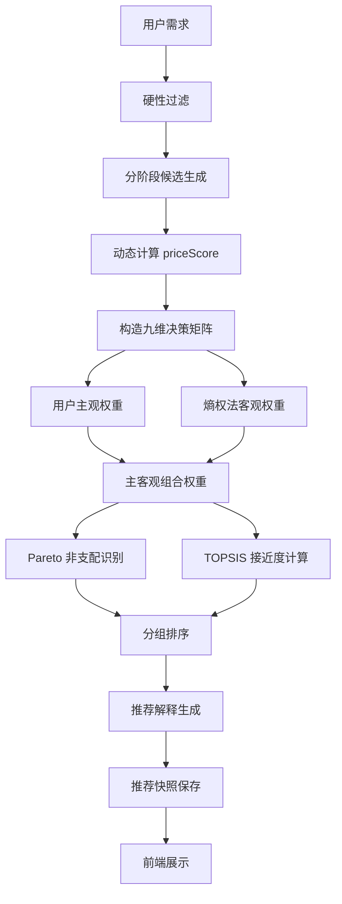

# 推荐算法升级设计：主客观组合权重 + Pareto-TOPSIS

本文档是后续算法重构的设计依据，目标算法名称为：

```text
基于主客观组合权重与 Pareto-TOPSIS 的可解释汽车推荐算法
```

本文档描述升级设计，不表示当前代码已经实现。当前已实现算法仍以 `docs/RECOMMENDATION_ALGORITHM.md` 为准；本升级文档用于指导后续代码重构、测试补充、接口说明和论文表述。

新算法仍属于面向冷启动场景的内容特征推荐和多指标决策方法，不是深度学习、协同过滤或在线学习。

## 1. 升级背景与目标

当前系统已经完成推荐闭环：车型参数生成特征评分，用户需求生成九维权重，推荐阶段动态计算价格分，再通过加权求和得到 `totalScore`，并保存推荐理由、不足提醒、匹配状态和推荐快照。

当前规则加权求和的优点是清晰、稳定、可解释，适合第一版 MVP。但它也存在算法表达深度一般、权重主要来自用户主观偏好、候选车型客观差异利用不足的问题。加权求和还天然允许维度补偿：某个车型可能在单一维度得分很高，从而掩盖用户重点关注维度上的明显短板。

汽车购买本质上是多约束、多指标、多目标的权衡决策。用户先用预算、车型、动力、座位数、排除品牌和排除车型限定候选范围，再在价格、空间、安全、能耗、智能、舒适、动力、口碑、热度等维度之间做综合取舍。

升级目标：

- 保留当前可解释推荐闭环和降级推荐能力。
- 将用户显式偏好作为主观权重。
- 使用熵权法引入候选车型客观差异信息。
- 使用主客观组合权重降低单纯主观权重的偏差。
- 使用 Pareto 非支配识别突出多维表现更均衡的候选。
- 使用 TOPSIS 相对接近度替代当前加权求和 `totalScore`。
- 将推荐解释从“高权重高分”升级为“维度贡献 + 理想解差距”。
- 推荐记录继续保存快照，历史记录不重新计算。

## 2. 第一性原理分析

购车推荐不能从“怎样排序一张车型列表”开始，而应从购车决策的基本事实出发：

1. 用户有硬性约束。预算上限、可接受车型集合、可接受动力集合、最低座位数、排除品牌、排除车型会决定哪些车型可以进入候选集。
2. 用户有主观偏好。不同用户对价格、空间、安全、能耗、智能、舒适、动力、口碑、热度的重视程度不同。
3. 车型有客观特征。车型参数、配置、口碑和销量可以转成 0-100 的多维评分。
4. 候选车型在不同指标上的区分度不同。如果所有候选在某个维度都接近，该维度对排序的客观区分价值较低。
5. 推荐不是单字段排序。只按价格、销量或安全分排序都无法表达真实购车取舍。
6. 推荐结果必须可解释和可追溯。系统需要说明为什么推荐、哪里不足，并保存当次需求、权重、分数、解释和匹配状态。

因此，升级算法应先处理硬性过滤和降级候选生成，再对候选集做多指标决策排序，最后保存用户可见结果和必要的算法快照。

## 3. 当前算法基线

当前后端核心实现集中在 `RecommendationServiceImpl`、`UserProfileServiceImpl` 和 `CarFeatureScoreCalculator`。

车型评分规则：

- `CarFeatureScoreCalculator` 将车型参数转换为八个静态评分：`spaceScore`、`safetyScore`、`energyScore`、`intelligenceScore`、`comfortScore`、`powerScore`、`reputationScore`、`popularityScore`。
- 所有评分均限制在 0-100，越高越好。
- `comfortScore = spaceScore * 0.5 + intelligenceScore * 0.2 + reputationScore * 0.3`。
- `popularityScore = salesVolume / maxSalesVolume * 100`。
- `priceScore` 不存入 `car_feature_score`，只在推荐阶段根据用户预算动态计算。

用户画像权重：

- 当前有效需求字段为 `bodyTypes`、`energyTypes`、`scenes`、`factorWeights`、`minSeats`、`budgetMin`、`budgetMax`、`excludedBrands`、`excludedCarIds`。
- `factorWeights` 是 0-10 滑块。只要至少一个维度大于 0，后端将其归一化为九维权重。
- 当 `factorWeights` 全部为 0 或未传时，后端使用 `scenes` 场景模板生成默认权重；`scenes` 为空时使用“综合需求”。
- 九维权重为 `price`、`space`、`safety`、`energy`、`intelligence`、`comfort`、`power`、`reputation`、`popularity`，总和为 1。

动态价格分：

- `budgetMax` 是严格阶段预算硬约束。
- `budgetMin` 是软偏好，只影响 `priceScore`。
- 超出预算上限的车型只可能在 `RELAX_BUDGET` 或 `SIMILAR_RECOMMEND` 阶段进入候选。

当前综合分：

```text
totalScore =
  priceScore * weightPrice
  + spaceScore * weightSpace
  + safetyScore * weightSafety
  + energyScore * weightEnergy
  + intelligenceScore * weightIntelligence
  + comfortScore * weightComfort
  + powerScore * weightPower
  + reputationScore * weightReputation
  + popularityScore * weightPopularity
```

降级推荐：

- 当前阶段包括 `STRICT`、`RELAX_BUDGET`、`RELAX_BODY_TYPE`、`RELAX_ENERGY_TYPE`、`SIMILAR_RECOMMEND`。
- 降级推荐是候选补充，不覆盖严格匹配结果。
- 同一车型只进入一次推荐集，`matchLevel` 保留首次进入阶段。
- `minSeats`、`excludedBrands`、`excludedCarIds` 不参与降级放宽。

排序与展示：

- 阶段 9.5 后，推荐生成不再接收或使用 `topK`，不再执行默认 Top 10 或 `min(5, topK)` 截断。
- 最终结果按 `STRICT` 组在前、非 `STRICT` 推荐组在后展示。
- 每组内部当前按 `totalScore desc`、`reputationScore desc`、`popularityScore desc` 排序。

解释与快照：

- 当前 `tags` 根据高分维度生成，并保存到 `recommend_item.tags`。
- `reasonText` 当前主要来自用户高权重维度和车型高分维度。
- `weaknessText` 当前主要来自用户高权重维度和车型低分维度。
- `recommend_record` 保存 `profileText`、`weightSnapshot`、`recommendStatus`、`fallbackMessage`。
- `recommend_item` 保存 `rankNo`、车型 ID、`totalScore`、`priceScore`、八个静态维度分、`tags`、`matchLevel`、`reasonText`、`weaknessText`。
- 历史详情读取保存快照，不重新计算历史推荐结果。

当前优点：

- 已经不是普通车型 CRUD 或简单 SQL 条件筛选。
- 推荐结果来自真实评分和用户权重。
- 支持分级补充推荐。
- 推荐结果可解释、可追溯。
- 用户端已按“完全匹配车型 / 推荐”分组展示。

当前不足：

- 排序算法仍是线性加权求和，算法表达偏基础。
- 权重主要来自用户主观表达，没有利用候选集自身的客观差异。
- 线性加权允许强补偿，可能让单一高分维度掩盖高权重维度短板。
- 推荐理由尚未体现与正理想解的距离，也没有说明哪些维度真正贡献了 TOPSIS 接近度。

## 4. 新算法总体流程



关键边界：

- 候选生成仍由硬性过滤和降级阶段负责。
- Pareto 和 TOPSIS 只在已生成候选集内部工作。
- `STRICT` 和非 `STRICT` 的展示分组不被 TOPSIS 打破。
- `totalScore` 字段继续保留，但语义升级为 TOPSIS 推荐分。

## 5. 推荐输入与指标体系

升级算法使用九个推荐指标：

| 指标 | 数据来源 | 说明 |
| --- | --- | --- |
| `price` | 动态 `priceScore` | 根据用户预算在推荐阶段计算 |
| `space` | `car_feature_score.space_score` | 空间表现 |
| `safety` | `car_feature_score.safety_score` | 安全配置 |
| `energy` | `car_feature_score.energy_score` | 能耗或续航 |
| `intelligence` | `car_feature_score.intelligence_score` | 智能配置 |
| `comfort` | `car_feature_score.comfort_score` | 舒适性 |
| `power` | `car_feature_score.power_score` | 动力表现 |
| `reputation` | `car_feature_score.reputation_score` | 口碑表现 |
| `popularity` | `car_feature_score.popularity_score` | 热度表现 |

统一约定：

- 所有指标范围为 0-100。
- 所有指标都是正向指标，越高越好。
- 价格不作为成本型指标进入 TOPSIS，因为已转换为正向的 `priceScore`。
- 参与 TOPSIS 前，将候选车型组成 `n * 9` 的决策矩阵。

## 6. 硬性过滤与降级候选生成

保留现有匹配阶段：

- `STRICT`
- `RELAX_BUDGET`
- `RELAX_BODY_TYPE`
- `RELAX_ENERGY_TYPE`
- `SIMILAR_RECOMMEND`

设计原则：

1. 降级推荐只负责生成候选集。
2. TOPSIS 只负责候选集内部排序。
3. 同一车型只进入一次推荐集。
4. `matchLevel` 保留车型首次进入推荐集的阶段。
5. `minSeats`、`excludedBrands`、`excludedCarIds` 不参与降级放宽。
6. `STRICT` 组仍优先展示。
7. 非 `STRICT` 统一归入用户端“推荐”组。
8. 用户端不展示技术性 `fallbackMessage` 顶部强提示。
9. 管理端和历史详情保留 `matchLevel`、`recommendStatus`、`fallbackMessage`。

候选生成完成后，先对所有候选计算九维分数，再执行主客观组合权重、Pareto 和 TOPSIS。这样可以保证降级逻辑与排序算法职责清晰，不把“放宽条件”混入分数公式。

## 7. 用户主观权重 subjectiveWeight

现有用户权重升级为主观权重 `subjectiveWeight`。

规则：

- 用户通过 `factorWeights` 滑块显式表达偏好。
- 如果 `factorWeights` 至少一个维度大于 0，则归一化为 `subjectiveWeight`。
- 如果 `factorWeights` 全部为 0 或未传，则由 `scenes` 场景模板生成。
- 如果 `scenes` 为空，则使用“综合需求”模板。
- `subjectiveWeight` 九维总和为 1。

公式：

```text
subjectiveWeight_j = rawWeight_j / sum(rawWeight)
```

其中 `j` 属于九个指标维度。若 `sum(rawWeight) <= 0`，使用场景模板或综合需求模板生成 `rawWeight` 后再归一化。

## 8. 熵权法客观权重 objectiveWeight

熵权法用于衡量候选车型在某个指标上的差异度：

- 差异越大，指标越有区分价值。
- 差异越小，指标提供的排序信息越少，客观权重越低。
- 熵权法只依赖当前候选集的评分矩阵，不依赖用户行为数据。

给定 `n` 辆候选车，`m = 9` 个指标：

```text
x_ij = 第 i 辆车在第 j 个指标上的分数
```

为避免 0 值导致对数计算问题：

```text
x'_ij = max(x_ij, epsilon)
epsilon = 0.0001
```

指标占比：

```text
p_ij = x'_ij / sum_i(x'_ij)
```

信息熵：

```text
e_j = -1 / ln(n) * sum_i(p_ij * ln(p_ij))
```

差异系数：

```text
d_j = 1 - e_j
```

客观权重：

```text
objectiveWeight_j = d_j / sum_j(d_j)
```

边界情况：

1. 如果候选车型数量 `n <= 1`，无法稳定计算熵权，`objectiveWeight` 退化为 `subjectiveWeight`。
2. 如果所有 `d_j` 之和为 0，说明候选在所有维度上的分布没有可用差异，推荐 `objectiveWeight` 退化为 `subjectiveWeight`，而不是均匀权重。原因是此时客观数据无法提供额外排序信息，应回到用户偏好。
3. 如果 `subjectiveWeight` 本身也异常为空，则最后兜底为九维均匀权重。
4. 所有指标必须已经是正向指标。

## 9. 主客观组合权重 finalWeight

组合权重公式：

```text
finalWeight_j =
  alpha * subjectiveWeight_j
  + (1 - alpha) * objectiveWeight_j
```

`alpha` 选择：

- 用户显式设置 `factorWeights` 时，`alpha = 0.75`。
- 用户未显式设置 `factorWeights`，仅使用 `scenes` 时，`alpha = 0.60`。

原因：

- 用户明确表达偏好时，应以用户偏好为主。
- 用户偏好模糊时，应适当提高候选车型客观区分度的影响。

要求：

- `finalWeight` 最终再次归一化，总和为 1。
- `recommend_record` 建议保存 `subjectiveWeight`、`objectiveWeight`、`finalWeight` 和算法版本快照。
- 若不新增数据库字段，可扩展现有 `weight_snapshot` JSON：

```json
{
  "algorithmVersion": "pareto-topsis-v1",
  "alpha": 0.75,
  "subjectiveWeight": {
    "price": 0.10,
    "space": 0.20,
    "safety": 0.20,
    "energy": 0.12,
    "intelligence": 0.08,
    "comfort": 0.18,
    "power": 0.04,
    "reputation": 0.06,
    "popularity": 0.02
  },
  "objectiveWeight": {
    "price": 0.14,
    "space": 0.10,
    "safety": 0.08,
    "energy": 0.18,
    "intelligence": 0.12,
    "comfort": 0.09,
    "power": 0.15,
    "reputation": 0.07,
    "popularity": 0.07
  },
  "finalWeight": {
    "price": 0.11,
    "space": 0.18,
    "safety": 0.17,
    "energy": 0.14,
    "intelligence": 0.09,
    "comfort": 0.16,
    "power": 0.07,
    "reputation": 0.06,
    "popularity": 0.02
  }
}
```

## 10. Pareto 非支配识别

Pareto 识别用于避免单一高分维度掩盖用户重点关注维度上的明显短板。它不替代 TOPSIS 排序，而是为组内排序增加“多维更稳”的优先级。

高权重维度集合 `K` 的候选方案：

| 方案 | 优点 | 风险 |
| --- | --- | --- |
| 取 `finalWeight` 最高的前 4 个维度 | 固定、简单、实现稳定，避免维度集合过大 | 当权重高度集中时，可能纳入少量弱关注维度 |
| 取 `finalWeight >= 平均权重` 的维度 | 能随用户偏好自动变化 | 权重接近均匀时可能纳入 9 个维度，使非支配判断过宽，排序区分度下降 |

推荐第一版采用“`finalWeight` 最高的前 4 个维度”。理由是实现最短、行为稳定、便于测试和答辩说明。九维权重完全均衡时，前 4 个维度可按固定维度顺序打破并列，避免 Pareto 集合过大。

Pareto 支配定义：

对于车型 A 和车型 B，如果：

```text
对所有 j in K，有 score_Aj >= score_Bj
并且至少存在一个 j in K，使 score_Aj > score_Bj
```

则 A 支配 B。

设计建议：

- 不直接删除被支配车型。
- 为每个推荐项计算 `paretoDominated` 标记。
- 非支配车型在同一展示组内部排序优先。
- 被支配车型仍可展示，但排序靠后。
- 第一版不实现多层 Pareto Rank，只保存或暴露 `paretoDominated: true / false`。

不做多层 Pareto Rank 的理由：

- 当前候选量和论文演示不需要复杂分层。
- 系统已有 `matchLevel` 分组和 `rankNo` 排名，再引入多层 Pareto Rank 会增加解释负担。
- 布尔标记足以支撑“非支配车型优先”的排序策略。

是否保存到 `recommend_item`：

- 若采用最小改动方案，可以不新增字段，只将 Pareto 结果用于排序，历史通过 `rankNo` 和 `totalScore` 回放用户可见结果。
- 若采用增强追溯方案，建议新增 `pareto_dominated` 字段，便于管理端说明排序依据。

## 11. TOPSIS 排序

输入：

```text
X = n * 9 的决策矩阵
x_ij = 第 i 辆车第 j 个指标的原始分数
```

向量归一化：

```text
r_ij = x_ij / sqrt(sum_i(x_ij^2))
```

加权归一化：

```text
v_ij = r_ij * finalWeight_j
```

正理想解：

```text
A+_j = max_i(v_ij)
```

负理想解：

```text
A-_j = min_i(v_ij)
```

到正理想解距离：

```text
D_i+ = sqrt(sum_j((v_ij - A+_j)^2))
```

到负理想解距离：

```text
D_i- = sqrt(sum_j((v_ij - A-_j)^2))
```

相对接近度：

```text
C_i = D_i- / (D_i+ + D_i-)
```

推荐分：

```text
totalScore = C_i * 100
```

边界情况：

1. 如果候选数 `n = 1`，推荐使用原加权效用分兜底，而不是直接给 100。原因是 TOPSIS 是相对排序方法，单候选直接给 100 会夸大匹配度；加权效用分仍能反映该车九维表现。
2. 如果 `D_i+ + D_i- = 0`，说明候选在加权矩阵上没有可区分差异，推荐使用加权效用分兜底；如果加权效用分也无法计算，再使用 50。
3. 所有指标已经是正向分，不需要成本型指标转换。

加权效用分兜底公式：

```text
utilityScore_i = sum_j(x_ij * finalWeight_j)
```

## 12. 最终排序规则

阶段 9.5 后的展示规则必须保留：

1. `STRICT` 组在前。
2. 非 `STRICT` 推荐组在后。
3. 每组内部：
   - Pareto 非支配优先。
   - `totalScore desc`。
   - `reputationScore desc`。
   - `popularityScore desc`。

约束：

- 不恢复 `topK`。
- 不恢复默认 Top 10。
- 不恢复 `min(5, topK)`。
- 不允许让非 `STRICT` 车型排到 `STRICT` 车型前面。
- `rankNo` 按最终展示顺序写入快照。

## 13. 推荐解释升级

升级后解释逻辑要从“高权重高分”升级为“维度贡献 + 理想解差距”。

推荐理由 `reasonText` 来源：

1. `finalWeight` 较高。
2. 车型在该维度标准化后得分较高。
3. 该维度对 TOPSIS 排序贡献较高。

贡献度可定义为：

```text
contribution_ij = finalWeight_j * r_ij
```

其中 `r_ij` 是 TOPSIS 向量归一化后的指标值。选择贡献最高的 2-3 个维度生成推荐理由。

不足提醒 `weaknessText` 来源：

1. 用户高权重维度。
2. 车型与正理想解差距较大。

差距可定义为：

```text
gap_ij = finalWeight_j * (A+_j - v_ij)
```

选择 `gap` 最大的 1-2 个维度生成不足提醒。

如果无明显短板，使用保底文案：

```text
该车型整体匹配较均衡，暂无明显短板。
```

要求：

- `reasonText` 和 `weaknessText` 仍保存快照。
- 历史详情不重新计算解释。
- 解释文案面向用户，不暴露公式变量。

## 14. 推荐标签 tags

`tags` 仍只表示推荐亮点，不表示匹配阶段。

允许的 `tags`：

- 空间优秀
- 安全配置高
- 能耗表现好
- 智能配置丰富
- 舒适性较好
- 动力表现强
- 口碑较好
- 热门车型
- 价格匹配度高
- 接近理想车型
- 多维表现均衡

禁止的 `tags`：

- 完全匹配
- 降级推荐
- 放宽预算
- 放宽车型
- 放宽动力
- 相似推荐
- STRICT
- RELAX_BUDGET
- RELAX_BODY_TYPE
- RELAX_ENERGY_TYPE
- SIMILAR_RECOMMEND

`matchLevel` 不能混入 `tags`。管理端如果需要展示 `matchLevel`，必须用独立字段和独立视觉元素。

## 15. 推荐记录快照设计

当前 `recommend_record` 和 `recommend_item` 已保存推荐追溯所需的大部分字段。升级后需要决定是否新增字段。

建议保存内容：

`recommend_record`：

- `algorithmVersion`
- `subjectiveWeightSnapshot`
- `objectiveWeightSnapshot`
- `finalWeightSnapshot`
- `recommendStatus`
- `fallbackMessage`
- `profileText`

`recommend_item`：

- `totalScore`，含义变为 TOPSIS 推荐分。
- `priceScore`。
- 九维分数快照。
- `matchLevel`。
- `tags`。
- `reasonText`。
- `weaknessText`。
- 可选：`paretoDominated`。
- 可选：`positiveDistance`。
- 可选：`negativeDistance`。
- 可选：`topsisCloseness`。

### 方案 A：最小改动方案

- 不新增表字段。
- 扩展已有 `recommend_record.weight_snapshot` JSON，保存 `algorithmVersion`、`alpha`、`subjectiveWeight`、`objectiveWeight`、`finalWeight`。
- `recommend_item.total_score` 仍保存最终推荐分，但语义改为 TOPSIS 推荐分。
- 不保存 TOPSIS 中间距离。
- 不保存 `paretoDominated` 字段，只通过 `rankNo` 和 `totalScore` 回放用户可见排序。

优点：

- 不改数据库表结构，符合当前最短路径。
- 当前推荐明细字段已能保存用户可见结果、维度分和解释。
- 适合本科毕设的实现和演示成本。

不足：

- 管理端无法直接展示 Pareto 标记和 TOPSIS 距离。
- 算法排查时只能通过权重快照、维度分和结果排序间接分析。

### 方案 B：增强追溯方案

- `recommend_record` 新增 `algorithm_version`，或保留在 `weight_snapshot` 中。
- `recommend_item` 新增：
  - `pareto_dominated`
  - `positive_distance`
  - `negative_distance`
  - `topsis_closeness`

优点：

- 管理端可完整展示 Pareto 和 TOPSIS 中间结果。
- 算法调试和论文截图更直接。

不足：

- 需要修改表结构、实体、Mapper、测试和历史详情 VO。
- 字段增加后前端管理端也要补充展示。
- 对当前项目来说追溯粒度可能超过最低必要范围。

推荐选择：

第一版推荐采用方案 A。理由是当前项目已经有完善的推荐快照字段，升级重点应放在算法正确性、解释生成和历史不重算，而不是扩展大量中间字段。若后续答辩或论文需要展示 TOPSIS 距离，再进入方案 B。

本次任务只写设计建议，不直接操作数据库。

## 16. API 与前端影响

不变接口：

- `POST /api/user/demand`
- `GET /api/user/demand/latest`
- `GET /api/user/demand/{id}`
- `POST /api/recommend/generate`
- `GET /api/recommend/{recordId}`
- `GET /api/recommend/history`

不变原则：

- 用户端提交需求 API 不变化。
- 推荐生成 API 不要求用户传算法参数。
- 推荐结果字段尽量保持现有结构。
- 用户端仍按“完全匹配车型 / 推荐”分组展示。

语义变化：

- `items[].totalScore` 从加权求和分升级为 TOPSIS 推荐分。
- `weights` 如果继续返回给前端，建议返回 `finalWeight`，因为它才是实际排序权重。
- `recommend_record.weight_snapshot` 的 JSON 结构升级为算法快照。

可选新增响应字段：

- `algorithmVersion`
- `scoreExplanation`
- `paretoDominated`

建议：

- 用户端不展示 TOPSIS 距离、熵权细节或 Pareto 技术说明，保持推荐结果页简洁。
- 用户端可以继续展示综合匹配度、推荐标签、理由、不足和维度分。
- 管理端推荐记录页可以展示算法版本、主观权重、客观权重和最终权重。
- 如果采用方案 A，管理端先只展示算法版本和权重快照，不展示 TOPSIS 距离。

## 17. 后端重构建议

当前 `RecommendationServiceImpl` 同时承担候选生成、价格分、加权求和、标签、理由、不足、排序和快照保存，后续不宜继续把升级算法堆在一个类里。但也不需要引入复杂策略框架。

最短路径拆分：

| 组件 | 职责 |
| --- | --- |
| `RecommendationCandidateService` | 候选生成、严格过滤、降级阶段、去重、`matchLevel` 保留 |
| `PriceScoreCalculator` | 动态价格分 |
| `RecommendationMatrixBuilder` | 构造九维决策矩阵和候选评分快照 |
| `EntropyWeightCalculator` | 熵权法客观权重 |
| `CombinedWeightCalculator` | `subjectiveWeight`、`objectiveWeight`、`finalWeight` 组合与归一化 |
| `ParetoAnalyzer` | 根据高权重维度计算 `paretoDominated` |
| `TopsisRanker` | TOPSIS 归一化、理想解、距离、接近度和兜底分 |
| `RecommendationExplanationService` | 基于贡献度和理想解差距生成理由、不足和标签 |
| `RecommendationSnapshotService` | 保存 `recommend_record` 和 `recommend_item` 快照 |

第一版实际落地可以合并部分组件：

- 必须抽出：候选生成、价格分、矩阵和权重、TOPSIS 排序、解释生成。
- 可暂缓独立：`RecommendationSnapshotService`，如果 Mapper 写入逻辑仍较少，可留在 `RecommendationServiceImpl` 作为编排层。

重构后的 `RecommendationServiceImpl` 应只做编排：

```text
load demand
-> build candidates
-> build matrix
-> calculate weights
-> analyze Pareto
-> rank by TOPSIS
-> generate explanations
-> sort groups and assign rankNo
-> save snapshots
-> build response
```

## 18. 测试设计

后续实现时至少增加或修改以下测试：

1. 主观权重归一化：显式 `factorWeights` 大于 0 时总和为 1。
2. 场景权重兜底：`factorWeights` 全部为 0 时使用 `scenes`，`scenes` 为空时使用“综合需求”。
3. 熵权法在候选差异较大时产生合理客观权重。
4. 熵权法 `n <= 1` 时退化为主观权重。
5. 所有 `d_j` 之和为 0 时退化为主观权重。
6. 主客观组合权重总和为 1。
7. 显式权重使用 `alpha = 0.75`，场景权重使用 `alpha = 0.60`。
8. Pareto 非支配识别：在高权重维度上全不低且至少一维更高时支配成立。
9. 被 Pareto 支配车型不删除，只在组内排序靠后。
10. TOPSIS 排序结果稳定，接近正理想解的车型 `totalScore` 更高。
11. TOPSIS `n = 1` 时使用加权效用分兜底。
12. `D_i+ + D_i- = 0` 时使用加权效用分或 50 兜底。
13. `STRICT` 组始终排在推荐组前。
14. 非 `STRICT` 不覆盖 `STRICT`，同一车型只保留首次 `matchLevel`。
15. `totalScore` 不再等于简单加权求和。
16. `reasonText` 来自贡献度最高的 2-3 个维度。
17. `weaknessText` 来自与正理想解差距最大的 1-2 个维度。
18. 历史记录读取快照，不重新计算分数、标签、理由、不足或 `matchLevel`。
19. `tags` 不包含 `matchLevel` 技术状态。
20. 不恢复 `topK` 推荐数量规则。

## 19. 分阶段实施计划

### 阶段 A：文档和测试基线

修改范围：

- 完成算法升级文档。
- 确认数据库快照采用方案 A 或方案 B。
- 准备 TOPSIS、熵权法和 Pareto 的固定测试样例。

验收标准：

- 文档能指导后续重构。
- 当前算法基线描述准确。
- 明确 `totalScore` 语义变化和快照方案。

测试要求：

- 暂不改业务代码时不执行构建。
- 后续进入代码前先补算法组件单元测试样例。

风险：

- 未确认快照方案前直接编码，可能导致历史追溯字段返工。

### 阶段 B：算法组件抽取

修改范围：

- 从 `RecommendationServiceImpl` 抽取候选生成、价格分、矩阵构建。
- 保持当前加权求和结果不变，先做结构拆分。

验收标准：

- 当前推荐接口行为不变。
- 现有推荐测试仍通过。

测试要求：

- 推荐生成、降级、历史快照相关测试必须通过。

风险：

- 抽取过程中破坏 `STRICT` 优先和 `matchLevel` 首次保留。

### 阶段 C：实现主客观组合权重

修改范围：

- 实现熵权法。
- 实现组合权重。
- 扩展 `weight_snapshot` JSON。

验收标准：

- `subjectiveWeight`、`objectiveWeight`、`finalWeight` 均可追溯。
- `finalWeight` 总和为 1。

测试要求：

- 覆盖显式权重、场景权重、候选少、无差异候选等边界。

风险：

- 熵权法在候选少时不稳定，必须有兜底。

### 阶段 D：实现 Pareto-TOPSIS 排序

修改范围：

- 实现 Pareto 标记。
- 实现 TOPSIS `totalScore`。
- 更新排序规则。

验收标准：

- `totalScore` 为 TOPSIS 推荐分。
- `STRICT` 组仍在前。
- 每组内部非支配优先，再按 `totalScore`、口碑、热度排序。

测试要求：

- 覆盖 TOPSIS 排序稳定性和 `totalScore` 不等于旧加权求和。

风险：

- TOPSIS 是相对候选集排序，候选变化会改变分数，需要在文档和前端说明。

### 阶段 E：解释生成升级

修改范围：

- 使用贡献度生成 `reasonText`。
- 使用理想解差距生成 `weaknessText`。
- 更新 `tags` 生成规则。

验收标准：

- 每条推荐仍有理由和不足。
- `tags` 只表示亮点，不混入匹配阶段。

测试要求：

- 覆盖高贡献维度理由、理想解差距不足、无明显短板保底文案。

风险：

- 文案不能过度技术化，用户端不应直接展示公式。

### 阶段 F：接口、前端和历史追溯适配

修改范围：

- 推荐详情可选返回 `algorithmVersion`。
- 管理端展示权重快照。
- 用户端保持现有简洁分组。

验收标准：

- 用户端不需要传算法参数。
- 历史详情读取保存快照。
- 管理端能追溯算法版本和权重。

测试要求：

- 历史详情快照测试必须覆盖新版权重快照。

风险：

- 若前端把技术状态放入 `tags`，会破坏用户端展示语义。

### 阶段 G：真实 MySQL 联调和答辩案例验证

修改范围：

- 使用真实 MySQL 进行全链路联调。
- 准备家庭出行、城市通勤、极端条件、候选差异明显等答辩案例。

验收标准：

- 需求提交、推荐生成、历史详情、管理端追溯均可用。
- 推荐结果能解释主观权重、客观权重、Pareto 和 TOPSIS 的作用。

测试要求：

- 执行后端测试、打包和前端构建。
- 真实库操作前必须获得确认。

风险：

- 真实库重建会清空联调数据，必须单独确认。

## 20. 风险与取舍

1. 算法复杂度上升。需要通过组件拆分和测试控制实现复杂度。
2. TOPSIS 是相对候选集排序，候选集变化会影响 `totalScore`，不能把分数解释成绝对市场评分。
3. 熵权法在样本少时不稳定，所以 `n <= 1` 和无差异候选必须退化。
4. Pareto 如果直接过滤会导致结果过少，因此只标记和排序，不删除候选。
5. `totalScore` 语义变化，需要文档、测试和前端说明同步。
6. 历史推荐必须保存快照，不能因为算法版本升级而重新计算旧记录。
7. 不要把该算法包装成机器学习、深度学习、协同过滤或在线学习。
8. 不要恢复旧推荐数量规则。
9. 不要恢复旧需求字段作为当前用户需求 API。

## 21. 论文与答辩表述

本系统不是普通车型筛选列表，也不是依赖用户行为数据的深度学习或协同过滤推荐系统。系统面向冷启动购车场景，基于车型内容特征和用户结构化需求进行推荐。

算法首先根据预算、车型类型、动力类型、最低座位数、排除品牌和排除车型执行硬性过滤，并在无完全匹配或匹配不足时进行分级补充推荐。随后系统将车型的价格匹配度、空间、安全、能耗、智能、舒适、动力、口碑和热度构造成九维决策矩阵。

在权重建模上，系统将用户显式偏好或场景模板生成的权重作为主观权重，同时使用熵权法根据候选车型在各指标上的差异度计算客观权重，再通过主客观组合权重得到最终排序权重。在排序阶段，系统使用 Pareto 非支配识别优先保留多维表现更稳的车型，并采用 TOPSIS 方法计算每辆候选车相对正负理想解的接近度，得到最终推荐分。

推荐结果不仅返回车型和分数，还保存推荐标签、推荐理由、不足提醒、匹配状态、权重快照和推荐明细快照。因此系统具备可解释、可降级、可追溯的特点，适合缺少长期用户行为数据的本科毕设汽车购买推荐场景。
